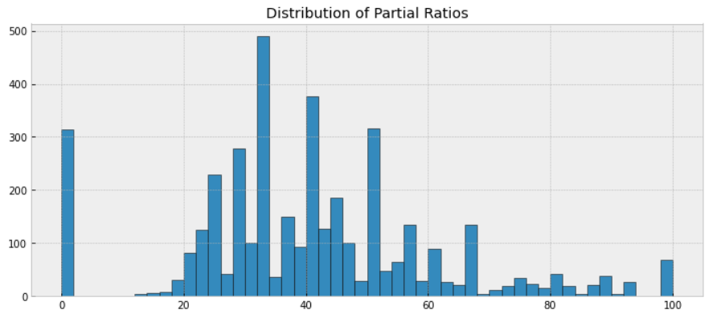

# Distractors Generator
Generation of distractors for multiple choice questions using OpenAI API.

---

### Installation

To install the package, run the following command:
```bash
pip install git+https://github.com/Ryzagi/distractors_generator.git
```

### Usage

For generation of distractors, you need to set `OPENAI_API_KEY` environment variable with your OpenAI API key.
```bash
export OPENAI_API_KEY=<your_api_key>
```

For generation of distractors, you can use the following command:

```bash
generate_distractors [-h] -i INPUT_PATH [-n COUNT] [-d DEDUPLICATE_TRIALS] [-o OUTPUT_PATH]

options:
  -h, --help            show this help message and exit
  -i INPUT_PATH, --input_path INPUT_PATH
                        Path to file with pairs of words and its translations
  -n COUNT, --count COUNT
                        Number of distractors to generate for each word
  -d DEDUPLICATE_TRIALS, --deduplicate_trials DEDUPLICATE_TRIALS
                        Max. number of trials to deduplicate distractors
  -o OUTPUT_PATH, --output_path OUTPUT_PATH
                        Path to the output JSON file

```

Where `input_path` is `.csv` file with pairs of words and its translations. The file should have the following format:
```
word,translation,source_language,target_language
word1,translation1,source_language1,target_language1
word2,translation2,source_language2,target_language2
...
```

For example:
```
word,translation,source_language,target_language
apple,яблоко,en,ru
cat,кiт,en,ukr
```

Example file can be found in `./data/input_pairs.csv` file.

Example of script usage:
```bash
generate_distractors -i ./data/input_pairs.csv -n 3 -o ./data/output_distractors.json
```

### Method 

For generation of distractors, we use OpenAI API `gpt-3.5-turbo` model with following prompt:

```
Act as language learning tests generator. You need to create set of distractors for input word.

Distractor is:
1. Thematically related word (or phrase)
2. Not the synonym of the given word (or contains synonym of the given word)
3. The same part of speech as the given word
4. Not the right translation of the given word in source language
5. Given in the target language (this is very important)

Don't add translation to source language in distractor, e.g. "собака (dog)".
Good distractor: "собака", bad distractor: "собака (dog)".

Very important: All output distractors should be in target language. They all must be different from each other.
Also, you need to make sure that all distractors are thematically related between each other and with the given word.

Firstly, you need to determine theme of the given word. Then, you need to generate distractors based on the theme in valid json structure.

Example user input: {"word": "cat", "translation": "кошка", "target_language": "ru", "source_language": "en", "num_distractors": 3}
Output:
{"theme": "pets (only house pets)", "1": "собака", "2": "хомяк", "3": "кролик"}

... <some more examples>
```

**Firstly**, we introduce some rules for distractors generation. This is used to align the outputs with the rules, instead of relying only on few-shot capabilities of the model. Rules can be seen in the prompt.

**Secondly**, we're providing some examples for few-shot learning. Model must generate valid json with following structure:
```
{
    "theme": "theme of the word",
    "1": "distractor 1",
    "2": "distractor 2",
    "3": "distractor 3",
    ...
}
```
Keys like `1`, `2`, `3` are used to align model to generate exactly `num_distractors` distractors. In our tests, output with more simple structure, e.g. list:

```
[
    "distractor 1",
    "distractor 2",
    "distractor 3",
    ...
]
```
was causing model to generate arbitrary number of distractors, which is not what we want.

**Thirdly**, our prompt uses some kind of [chain-of-thoughts](https://www.promptingguide.ai/techniques/cot) by adding `theme` to the outputs. In our tests, this helped model to generate more coherent distractors.

### Post-processing

After generation of distractors, we're performing some post-processing steps to improve quality of the distractors.

We found, that in some hard cases, model are struggling to generate diverse distractors and was generating partially or fully the same distractors. To solve this, we're performing deduplication of distractors. We're using [fuzzy string matching](https://github.com/maxbachmann/RapidFuzz) (`partial_ratio`) to measure similarity between distractors. If similarity is higher than some threshold, we're removing one of the distractors.

Histogram of partial ratio between distractors (~1000 samples).



We found, that optimal threshold for partial ratio is `90`. This threshold is used in the script by default.

Example of word pairs with their `partial_ratios`:

| Word A         | Word B           | partial_ratio |
|----------------|------------------|---------------|
| озеро          | крещенское озеро | 100           |
| волейбол       | пляжный волейбол | 100           |
| племянник      | племянница       | 94            |
| ужинать        | ужин             | 90            |
| восхитительный | обаятельный      | 78            |

After score of about `90` nearly all pairs was duplicates.


### De-duplication

After finding duplicates, we are generating new distractors for the duplicates. We're using the same prompt. We're also using `deduplicate_trials` parameter to limit number of trials for deduplication. If we're not able to generate new distractors in `deduplicate_trials` trials, we're keeping the original distractors.

Additionally, we are using higher values of `temperature` parameter for `gpt-3.5-turbo` model. This is used to generate more diverse distractors.


### Results

Results for `./data/input_pairs.csv` file with `10` distractors per word are stored in `./data/output_distractors.json` file.
